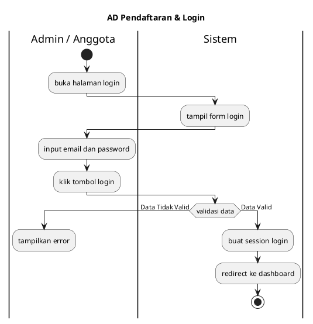
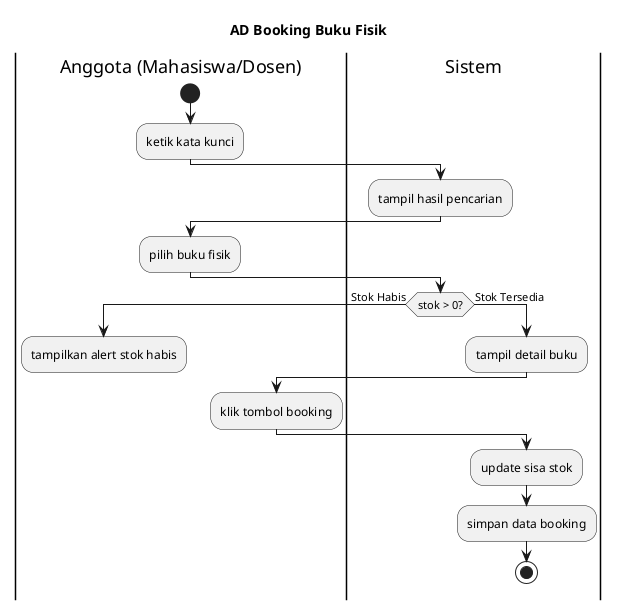
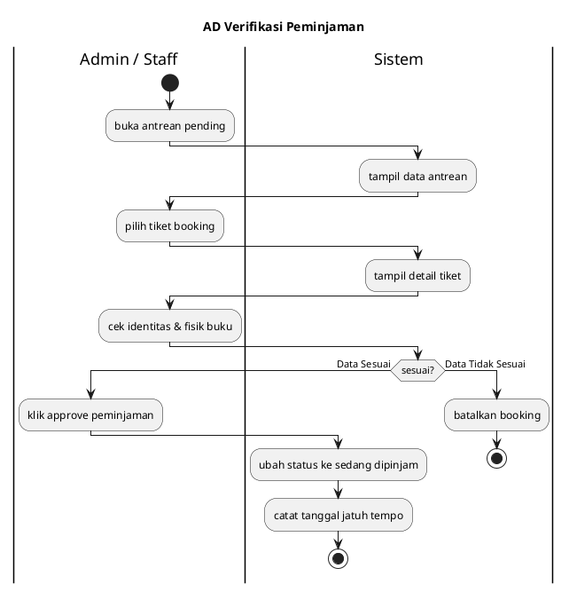
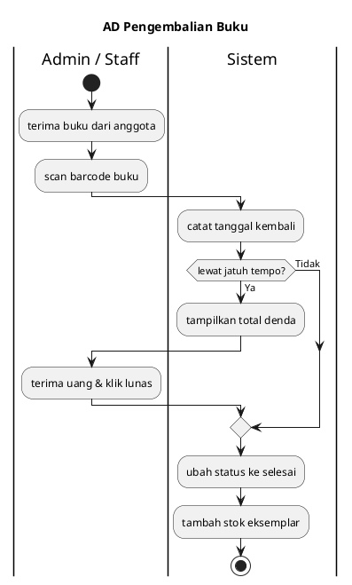

# 4.2.2 Activity Diagram (Hasil Analisis Sistem)

Activity diagram adalah representasi visual dari alur kerja (workflow) atau aktivitas sistem yang menggambarkan langkah-langkah secara berurutan. Format ini disusun menggunakan model **Multilane Pool (Swimlane)** yang dibungkus oleh satu bingkai utama (Pool) dan dibagi menjadi dua lajur (Swimlanes).

**PENTING UNTUK DIGUNAKAN DI DRAW.IO:**
Karena kode `mermaid` seringkali _ngaco_ (_strecthed/awur-awuran_) saat me-render _Swimlane_, **gunakan kode PlantUML di bawah ini.**
Caranya di Draw.io: Klik **Arrange** -> **Insert** -> **Advanced** -> **PlantUML** lalu tempel kode-kodenya. Draw.io akan meng-_generate_ tabel kotak (Pool & Swimlanes) **100% SAMA PERSIS** seperti gambar referensi Anda tanpa kocar-kacir!

---

## 1. Modul Registrasi Anggota & Login

---

## 2. Modul Pencarian dan Booking Buku Fisik

---

## 3. Modul Proses Verifikasi (Approve) Peminjaman

---

## 4. Modul Pengembalian & Pembayaran Denda

