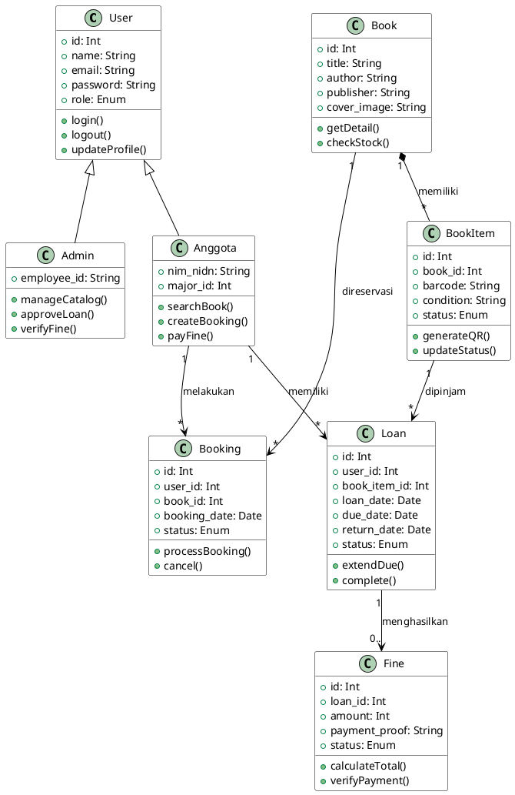
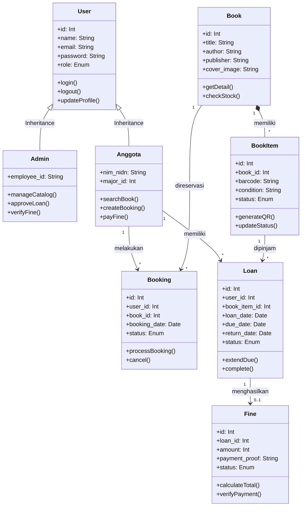

# 4.2.4 Class Diagram (Hasil Analisis Sistem)

_Class Diagram_ adalah pemodelan visual yang menjabarkan struktur inti dari sistem dengan menggambarkan kelas-kelas (objek), atribut (field/variabel), operasi (metode/fungsi), serta hubungan antar kelas (seperti _Inheritance/Pewarisan_ dan _Association/Relasi_).

Dalam sistem perpustakaan _Smart-Lib_, telah digambarkan struktur _Model_ berbasis _Object-Oriented Programming (OOP)_. Pada gambaran di bawah, Anda bisa melihat ada struktur **Pewarisan (Inheritance)** dari kelas induk (Parent Class), yaitu `User`, yang diturunkan sifatnya mendetail ke kelas _Child_ spesifik (`Admin` dan `Anggota`).

---

## 1. Kode PlantUML (Sangat Disarankan untuk Draw.io)

_**Cara Penggunaan Terbaik:** Seperti biasa, Buka Draw.io -> Arrange -> Insert -> Advanced -> PlantUML. Lalu tempel kode sintaks di bawah ini. Skema garis, pewarisan segitiga, dan pewarnaan hitam-putih murninya akan langsung tergambar menduplikasi pola gaya referensi diagram Anda._

---

## 2. Diagram Mermaid JS (Format Preview Dokumen)

_Preview diagram murni menggunakan ekstensi Markdown secara langsung:_

### Panduan Notasi / Simbol Visio & Draw.io

Jika merakit kotak tabel _Class_ ini secara mandiri _(drag-and-drop)_, perhatikan makna simbol atribut berikut agar tidak disalahkan oleh pembimbing:

1. **Model Kotak 3 Tingkat**: Setiap Class wajib dipecah menjadi 3 baris horisontal: _Nama Class_ (Paling atas tebal), _Attribute/Properties_ (Tengah), dan _Option/Method_ (Bawah, yang selalu diakhiri dengan tanda kurung).
2. **Tanda Plus `+`**: Melambangkan hak akses **Public**, yang artinya Method/Attribut tersebut bisa dipanggil dan dimanipulasi oleh Class manapun.
3. **Tanda Minus `-`**: Melambangkan kerahasiaan data **Private**, yang artinya atribut/fungsi tersebut hanya bisa dikelola murni oleh kelas itu sendiri (Misal: Password).
4. **Panah Kosong Segitiga (`<|--`)**: Disebut _Generalization / Inheritance_. Panah ini mengarah ke atas (kelas utama induk). Persis seperti panah yang Anda jadikan referensi pada gambar (Duck, Fish, Zebra mewarisi sifat class Animal).
5. **Panah Garis Lurus (`-->`)**: Disebut _Directed Association_, digunakan untuk menandakan arah perintah operasional sebuah kelas pada kelas lainnya (Misal: Anggota menciptakan Booking).
6. **Panah Layang-layang Transparan / Hitam (`*--`)**: Disebut _Composition / Aggregation_, menunjukkan kepemilikan mutlak. (_BookItem_ eksemplar fisik tidak mungkin pernah eksis / bisa ada jika katalog Master induk _Book_ tidak dibuat).
