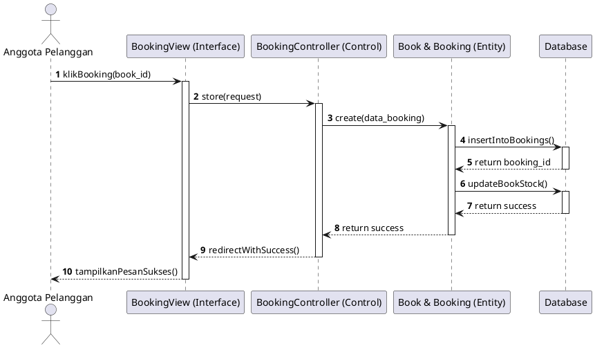
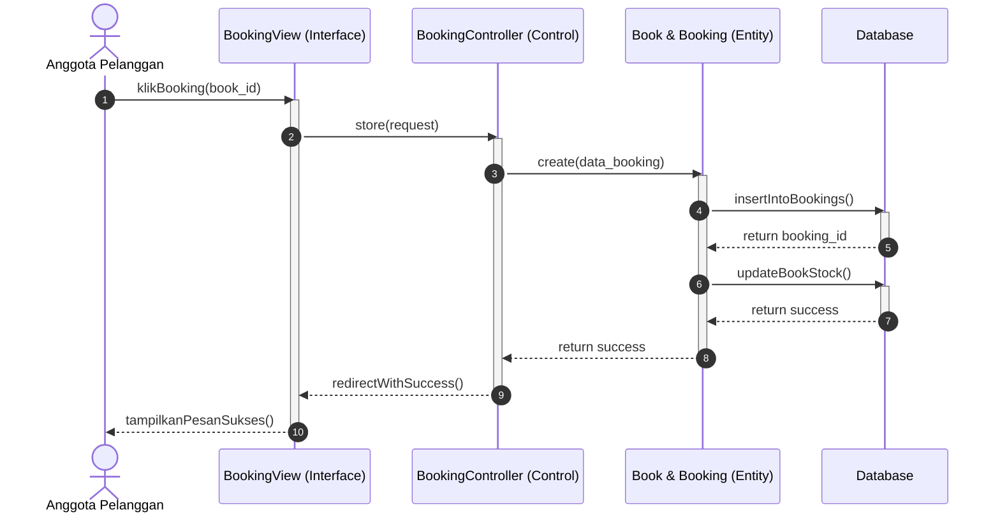
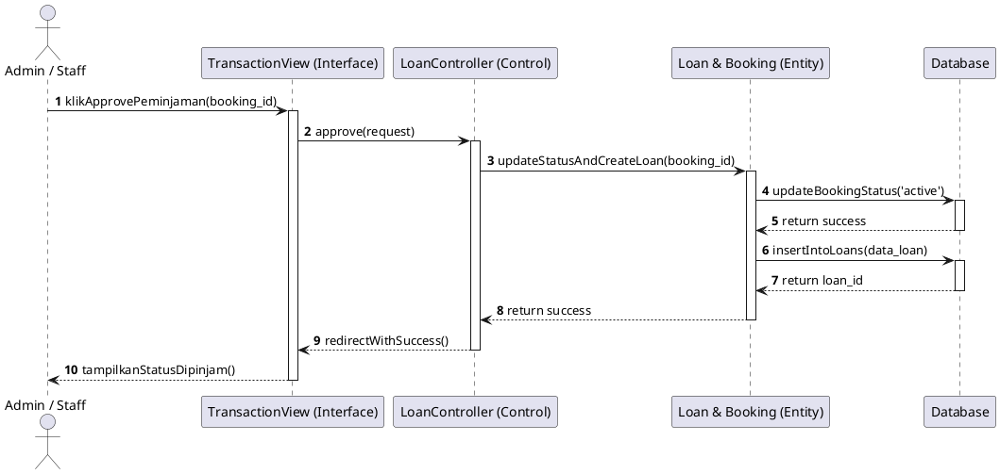
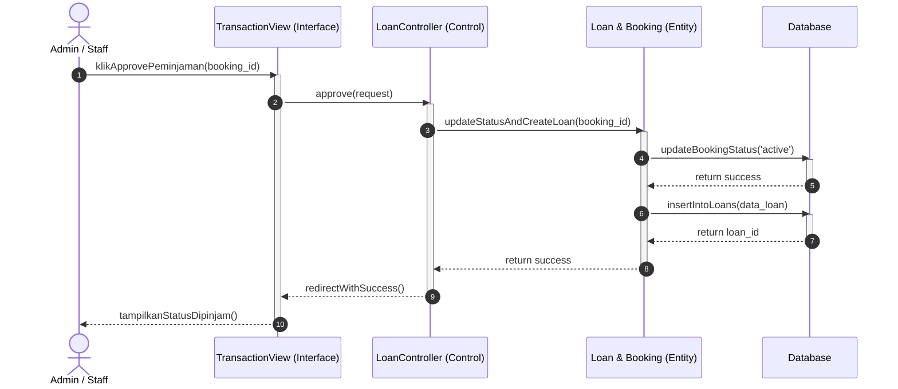
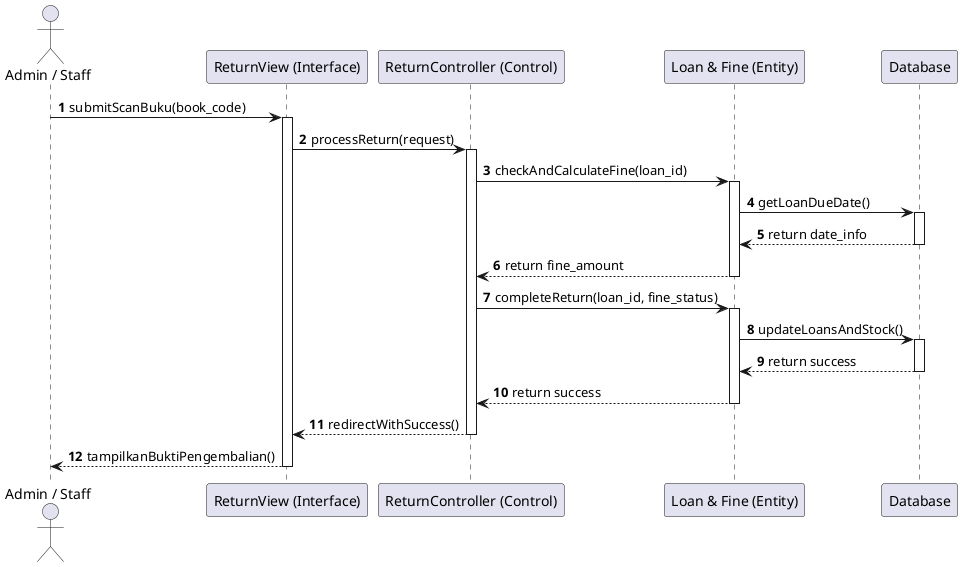
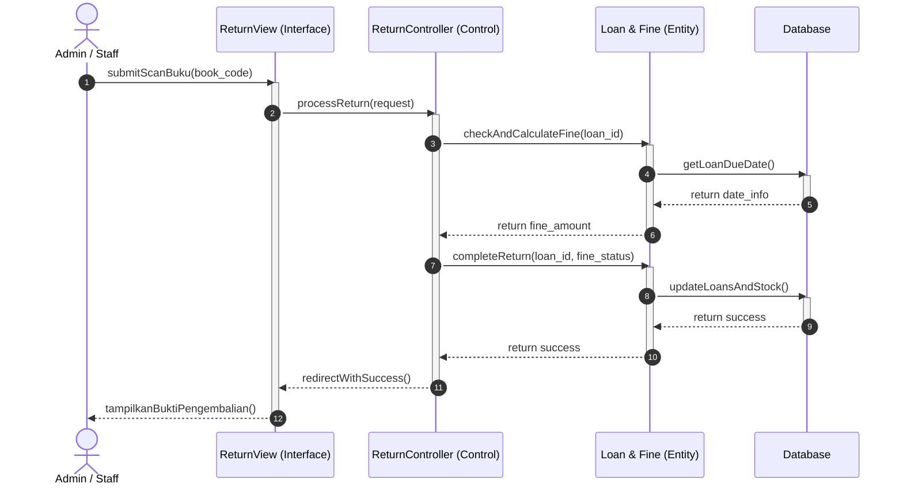

# 4.2.3 Sequence Diagram (Hasil Analisis Sistem)

_Sequence Diagram_ menggambarkan interaksi antar objek di dalam dan di sekitar sistem (termasuk aktor, tampilan antarmuka, pengontrol, dan database) berupa pengiriman pesan _(messages)_ terhadap waktu. Spesifikasi relasi objek (_Lifelines_) yang digunakan pada sistem _Smart-Lib_ ini merujuk secara teknikal meniru pola arsitektur MVC (Model-View-Controller) milik framework Laravel.

Diagram di bawah ini secara lengkap menyematkan representasi kotak _boundary-interface_ (View), kotak _control_ (Controller), dan lambang _entity-model_ (Database & Class). Terdapat versi Mermaid.js dan PlantUML untuk setiap modul (kami merekomendasikan paste kode **PlantUML ke Draw.io** untuk hasil kotak _lifelines_ yang sama persis seperti gambar yang Anda ajukan).

---

## 1. Modul Pencarian & Booking Buku Fisik

Alur pengiriman pesan _(request-return)_ ketika pengguna (Mahasiswa/Dosen) memproses penambahan tiket pesanan (booking).

### A. Kode PlantUML (Disarankan untuk Draw.io)

_Cara Penggunaan: Buka Draw.io -> Arrange -> Insert -> Advanced -> PlantUML_

### B. Diagram Mermaid JS

---

## 2. Modul Proses Verifikasi Peminjaman oleh Admin

Alur interaksi logika ketika Admin meng-_approve_ tiket yang masuk hingga _State_ pesanan tercatat 'Aktif'.

### A. Kode PlantUML (Disarankan untuk Draw.io)

### B. Diagram Mermaid JS

---

## 3. Modul Pengembalian Buku & Perhitungan Denda

Alur interaksi saat buku fisik dicatat pulang, serta kalkulasi uang keterlambatan (_fines_).

### A. Kode PlantUML (Disarankan untuk Draw.io)

### B. Diagram Mermaid JS

