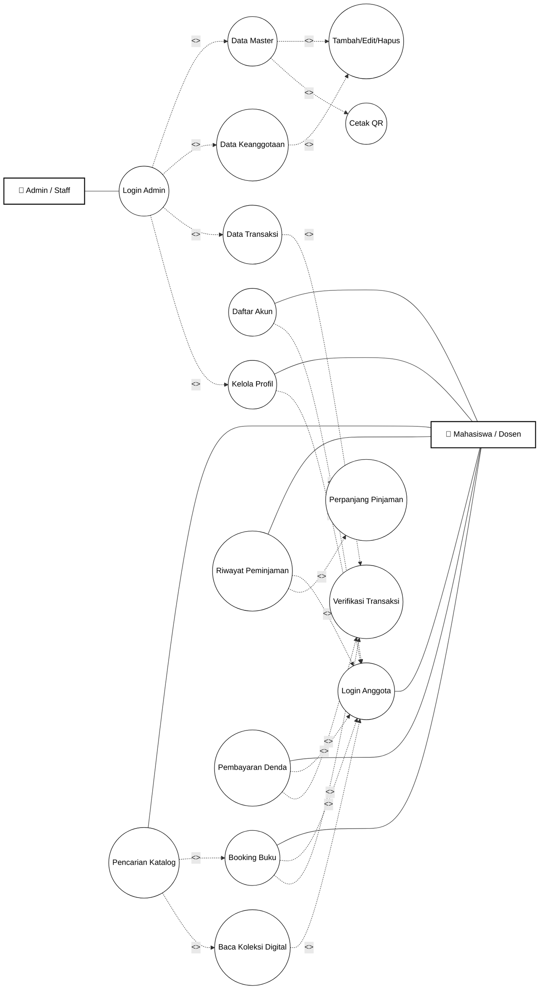
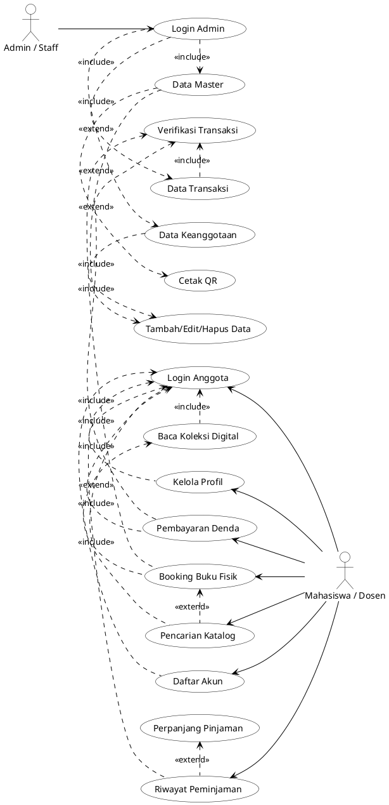

# 4.2.1 Use Case Diagram (Hasil Analisis Sistem)

Use Case Diagram menggambarkan interaksi antara sistem dengan aktor luar yang menggunakan sistem ini. Untuk sistem perpustakaan _Smart-Lib_, terdapat dua aktor utama yang dianalisis, yaitu **Admin / Staff** dan **Mahasiswa / Dosen** (sebagai pengguna atau anggota perpustakaan).

Berikut adalah identifikasi peran dari masing-masing aktor:

1. **Admin / Staff**: Bertanggung jawab secara penuh dalam mengelola data master sistem, sirkulasi transaksi peminjaman, serta operasional administratif seperti validasi denda dan pendaftaran koleksi katalog buku.
2. **Mahasiswa / Dosen (Anggota)**: Pengguna yang diberikan akses untuk mengeksplorasi layanan perpustakaan secara mandiri, seperti melihat modul katalog, melakukan _booking_ buku, membaca koleksi _e-book_ digital, dan mengelola sirkulasi pribadi serta denda mereka.

---

## 1. Visualisasi Use Case Diagram (Mermaid)

_Gunakan ekstensi atau viewer Markdown yang mendukung `mermaid js` untuk melihat diagram di bawah secara langsung. Visualisasi ini telah disesuaikan dengan struktur dan tata letak relasi menyebar yang Anda bagikan sebagai referensi._

---

## 2. Solusi Layout Otomatis Rapi di Draw.io (Menggunakan PlantUML)

Agar Peletakan Aktor persis berada di **Sayap Kiri dan Sayap Kanan** mengapit semua fitur layaknya gambar referensi Anda (tidak ada kotak sistem vertikal dan tidak menumpuk di sisi kiri semua), ikuti pembaruan kode ini di Draw.io:

1. Buka Draw.io
2. Klik Menu **Arrange** (Tata Letak) di bar atas -> Pilih **Insert** (Sisipkan) -> Klik **Advanced** (Lanjutan) -> Pilih **PlantUML**.
3. **Copy-Paste kode ajaib di bawah ini**:

4. Klik **Insert**. Tampilannya akan otomatis melebar dengan komposisi visual **Persis seperti gambar referensi Anda** (Admin di kiri pojok, Mahasiswa di Kanan pojok, fitur menyebar rapih di tengah).
