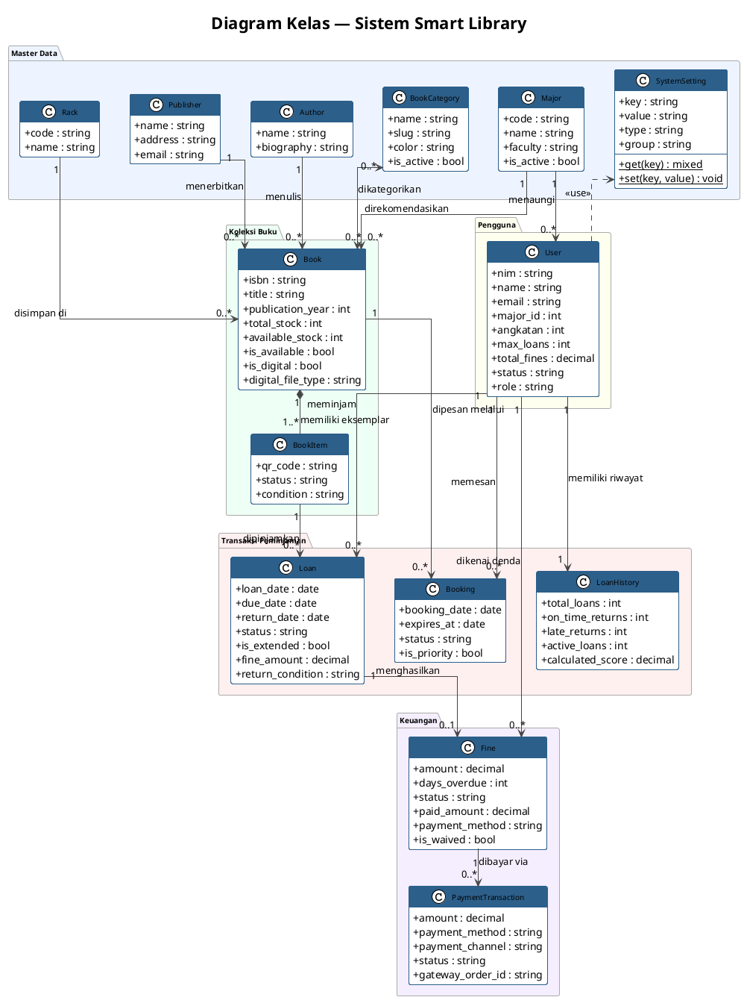
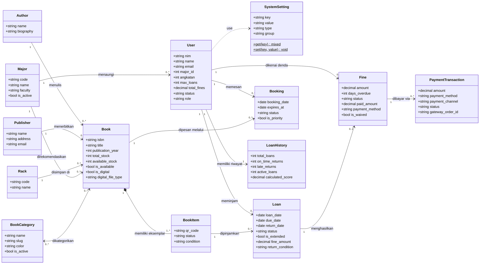

# Class Diagram Ringkas — Smart Library System
*(Versi Draft Skripsi — A4 Landscape)*

---

## PlantUML

> Render di: https://www.planttext.com atau plugin VS Code PlantUML

---

## Mermaid

> Render di: GitHub, Notion, Obsidian, atau https://mermaid.live

---

## Tips Cetak ke Kertas Skripsi

| Pengaturan | Rekomendasi |
|---|---|
| **Orientasi kertas** | Landscape (A4) |
| **Export PlantUML** | SVG → buka di browser → Print to PDF |
| **Export Mermaid** | [mermaid.live](https://mermaid.live) → Download PNG (pilih resolusi tinggi) |
| **Ukuran font** | Minimal 8pt agar terbaca |
| **Posisi di skripsi** | Gambar landscape biasanya ditempatkan miring (rotate 90°) di halaman tersendiri |
