# Class Diagram — Smart Library System

> Dibuat berdasarkan seluruh model Eloquent yang ada setelah berbagai pembaruan sistem.
> Mengikuti standar UML 2.x dengan best practice: visibility modifier, stereotypes, multiplicity, dan pengelompokan paket.

---

## 1. PlantUML

```plantuml
@startuml SmartLibrary_ClassDiagram
!theme plain
skinparam classAttributeIconSize 0
skinparam classFontSize 12
skinparam classHeaderBackgroundColor #4A90D9
skinparam classHeaderFontColor #FFFFFF
skinparam classBorderColor #2C5F8A
skinparam packageBorderColor #888888
skinparam packageBackgroundColor #F8F8F8
skinparam ArrowColor #333333
skinparam linetype ortho

title Smart Library — Class Diagram\n(Laravel 11 + Eloquent ORM)

' =============================================
' PACKAGE: Master Data
' =============================================
package "Master Data" #DDEEFF {

  class Major <<entity>> {
    +id : int
    +code : string
    +name : string
    +faculty : string
    +description : string
    +is_active : bool
    --
    +users() : HasMany
    +recommendedBooks() : HasMany
    +scopeActive(query) : Builder
    +getFullNameAttribute() : string
  }

  class Author <<entity>> {
    +id : int
    +name : string
    +biography : string
    +photo : string
    +deleted_at : datetime
    --
    +books() : HasMany
  }

  class Publisher <<entity>> {
    +id : int
    +name : string
    +address : string
    +email : string
    +phone : string
    +deleted_at : datetime
    --
    +books() : HasMany
  }

  class Rack <<entity>> {
    +id : int
    +code : string
    +name : string
    +description : string
    --
    +books() : HasMany
  }

  class BookCategory <<entity>> {
    +id : int
    +name : string
    +slug : string
    +description : string
    +color : string
    +is_active : bool
    --
    +books() : BelongsToMany
    +scopeActive(query) : Builder
    +getBadgeStyleAttribute() : string
  }

  class SystemSetting <<entity>> {
    +id : int
    +key : string
    +value : string
    +type : string
    +group : string
    +display_name : string
    +description : string
    --
    +{static} get(key, default) : mixed
    +{static} set(key, value, type) : self
    -{static} castValue(value, type) : mixed
  }
}

' =============================================
' PACKAGE: Koleksi Buku
' =============================================
package "Koleksi Buku" #DDFFF0 {

  class Book <<entity>> {
    +id : int
    +isbn : string
    +title : string
    +subtitle : string
    +author_id : int
    +publisher_id : int
    +rack_id : int
    +recommended_for_major_id : int
    +added_by : int
    +publication_year : int
    +edition : string
    +pages : int
    +language : string
    +cover_image : string
    +description : string
    +total_stock : int
    +available_stock : int
    +is_available : bool
    +is_featured : bool
    +is_digital : bool
    +digital_file_path : string
    +digital_file_type : string
    +digital_file_size : int
    +digital_download_count : int
    +keywords : string
    +deleted_at : datetime
    --
    +authorMaster() : BelongsTo
    +publisherMaster() : BelongsTo
    +categories() : BelongsToMany
    +loans() : HasMany
    +recommendedForMajor() : BelongsTo
    +addedBy() : BelongsTo
    +rack() : BelongsTo
    +bookItems() : HasMany
    +canBeBorrowed(quantity) : bool
    +decrementStock(qty) : void
    +incrementStock(qty) : void
    +canBeAccessedBy(user) : bool
    +getCoverUrlAttribute() : string
    +getFullTitleAttribute() : string
    +getDigitalFileUrlAttribute() : string
    +scopeAvailable(query) : Builder
    +scopeFeatured(query) : Builder
    +scopeDigital(query) : Builder
    +scopePhysical(query) : Builder
  }

  class BookItem <<entity>> {
    +id : int
    +book_id : int
    +qr_code : string
    +status : string
    +condition : string
    +notes : string
    +deleted_at : datetime
    --
    +book() : BelongsTo
    -recalculateBookStock() : void
  }

  note right of BookItem
    status:
    available | on_loan
    reserved | damaged | lost
  end note

  note right of Book
    digital_file_type:
    pdf | epub | skripsi
    is_digital = false : Buku Fisik
    is_digital = true  : Digital/Skripsi
  end note
}

' =============================================
' PACKAGE: Pengguna & Peran
' =============================================
package "Pengguna & Peran" #FFF8DD {

  class User <<entity>> {
    +id : int
    +nim : string
    +username : string
    +email : string
    #password : string
    +name : string
    +phone : string
    +card_number : string
    +avatar : string
    +major_id : int
    +angkatan : int
    +credit_score : decimal
    +max_loans : int
    +total_fines : decimal
    +status : string
    +email_verified_at : datetime
    +deleted_at : datetime
    --
    +major() : BelongsTo
    +loans() : HasMany
    +activeLoans() : HasMany
    +bookings() : HasMany
    +fines() : HasMany
    +isMahasiswa() : bool
    +isDosen() : bool
    +isStaff() : bool
    +isAdmin() : bool
    +canBorrow() : bool
    +updateMaxLoans() : void
    +updateLoanHistory() : void
    +recalculateCreditScore() : void
    +getRoleNameAttribute() : string
    +getAvatarUrlAttribute() : string
    +scopeActive(query) : Builder
    +scopeMahasiswa(query) : Builder
    +scopeDosen(query) : Builder
  }

  note right of User
    Roles (via Spatie):
    admin | staff | mahasiswa | dosen
    status: active | inactive | suspended
  end note
}

' =============================================
' PACKAGE: Transaksi Peminjaman
' =============================================
package "Transaksi Peminjaman" #FFE8E8 {

  class Loan <<entity>> {
    +id : int
    +user_id : int
    +book_item_id : int
    +processed_by : int
    +returned_to : int
    +loan_date : date
    +due_date : date
    +return_date : date
    +status : string
    +is_extended : bool
    +original_due_date : date
    +extended_at : datetime
    +fine_amount : decimal
    +fine_paid : bool
    +fine_paid_at : datetime
    +return_condition : string
    +return_notes : string
    +requested_at : datetime
    +pickup_deadline : datetime
    +deleted_at : datetime
    --
    +user() : BelongsTo
    +bookItem() : BelongsTo
    +processedBy() : BelongsTo
    +returnedTo() : BelongsTo
    +fine() : HasOne
    +isOverdue() : bool
    +isPickupExpired() : bool
    +canBeExtended() : bool
    +extend(additionalDays) : bool
    +calculateFine() : float
    +getDaysOverdue() : int
    +confirmPickup(processedBy, loanDays) : void
    +cancelPendingPickup(reason) : void
    +processReturn(condition, notes, returnedTo) : void
    #notifyBookings() : void
    +scopeActive(query) : Builder
    +scopeOverdue(query) : Builder
    +scopePendingPickup(query) : Builder
    +getStatusColorAttribute() : string
    +getDaysUntilDueAttribute() : int
  }

  note right of Loan
    status:
    pending_pickup | active
    extended | overdue | returned
  end note

  class Booking <<entity>> {
    +id : int
    +user_id : int
    +book_id : int
    +booking_date : date
    +expires_at : date
    +status : string
    +is_priority : bool
    +notified_at : datetime
    +fulfilled_at : datetime
    +notes : string
    --
    +user() : BelongsTo
    +book() : BelongsTo
    +isExpired() : bool
    +notify() : void
    +fulfill() : void
    +cancel(reason) : void
    +expire() : void
    +scopePending(query) : Builder
    +scopeExpired(query) : Builder
    +getStatusColorAttribute() : string
  }

  class LoanHistory <<entity>> {
    +id : int
    +user_id : int
    +total_loans : int
    +on_time_returns : int
    +late_returns : int
    +total_extensions : int
    +total_fines_incurred : decimal
    +total_fines_paid : decimal
    +active_loans : int
    +overdue_loans : int
    +calculated_score : decimal
    +last_loan_at : datetime
    +last_return_at : datetime
    --
    +user() : BelongsTo
    +getPerformanceRatingAttribute() : string
    +getOnTimePercentageAttribute() : float
    +getUnpaidFinesAttribute() : float
  }
}

' =============================================
' PACKAGE: Keuangan
' =============================================
package "Keuangan" #F0E8FF {

  class Fine <<entity>> {
    +id : int
    +loan_id : int
    +user_id : int
    +paid_to : int
    +waived_by : int
    +amount : decimal
    +days_overdue : int
    +daily_rate : decimal
    +status : string
    +paid_amount : decimal
    +paid_at : date
    +is_waived : bool
    +waive_reason : string
    +waived_at : datetime
    +payment_method : string
    +payment_reference : string
    +notes : string
    --
    +loan() : BelongsTo
    +user() : BelongsTo
    +paidTo() : BelongsTo
    +waivedBy() : BelongsTo
    +processPayment(amount, method, ref, paidTo) : void
    +waive(reason, waivedBy) : void
    +isFullyPaid() : bool
    +getRemainingAmountAttribute() : float
    +getStatusColorAttribute() : string
    +scopeUnpaid(query) : Builder
    +scopePaid(query) : Builder
  }

  note right of Fine
    status: unpaid | paid | waived
    payment_method:
    cash | transfer | qris | va | ewallet
  end note

  class PaymentTransaction <<entity>> {
    +id : int
    +fine_id : int
    +user_id : int
    +amount : decimal
    +payment_method : string
    +payment_channel : string
    +gateway_order_id : string
    +gateway_transaction_id : string
    +qr_code_url : string
    +va_number : string
    +status : string
    +expires_at : datetime
    +paid_at : datetime
    +metadata : json
    +notes : string
    --
    +fine() : BelongsTo
    +user() : BelongsTo
    +isExpired() : bool
    +markAsSuccess(transactionId) : void
    +markAsFailed(reason) : void
    +markAsExpired() : void
    +getPaymentMethodLabelAttribute() : string
    +getChannelNameAttribute() : string
    +getStatusColorAttribute() : string
    +scopeSuccess(query) : Builder
    +scopePending(query) : Builder
  }
}

' =============================================
' RELASI ANTAR KELAS
' =============================================

Author      "1" --o{ "0..*" Book       : menulis >
Publisher   "1" --o{ "0..*" Book       : menerbitkan >
Rack        "1" --o{ "0..*" Book       : menyimpan >
BookCategory "0..*" }--{ "0..*" Book   : dikategorikan
Major       "1" --o{ "0..*" Book       : direkomendasikan untuk >
Book        "1" *--{ "1..*" BookItem   : memiliki eksemplar >
Major       "1" --o{ "0..*" User       : menaungi >
User        "1" --o{ "0..*" Loan       : meminjam >
User        "1" --o{ "0..*" Booking    : memesan >
User        "1" --o{ "0..*" Fine       : dikenai denda >
User        "1" --||       "1" LoanHistory : memiliki riwayat >
User        "1" --o{ "0..*" Loan       : memproses >
BookItem    "1" --o{ "0..*" Loan       : dipinjamkan >
Book        "1" --o{ "0..*" Booking    : dipesan melalui >
Loan        "1" --||    "0..1" Fine    : menghasilkan >
Fine        "1" --o{ "0..*" PaymentTransaction : dibayar via >
User        "1" --o{ "0..*" PaymentTransaction : melakukan pembayaran >
User        ..>            SystemSetting : <<use>> membaca konfigurasi

@enduml
```

---

## 2. Mermaid

```mermaid
classDiagram
  direction TB

  %% ─────────────────────────────────
  %% MASTER DATA
  %% ─────────────────────────────────
  class Major {
    <<entity>>
    +int id
    +string code
    +string name
    +string faculty
    +string description
    +bool is_active
    +users() HasMany
    +recommendedBooks() HasMany
    +scopeActive(query) Builder
    +getFullNameAttribute() string
  }

  class Author {
    <<entity>>
    +int id
    +string name
    +string biography
    +string photo
    +datetime deleted_at
    +books() HasMany
  }

  class Publisher {
    <<entity>>
    +int id
    +string name
    +string address
    +string email
    +string phone
    +datetime deleted_at
    +books() HasMany
  }

  class Rack {
    <<entity>>
    +int id
    +string code
    +string name
    +string description
    +books() HasMany
  }

  class BookCategory {
    <<entity>>
    +int id
    +string name
    +string slug
    +string description
    +string color
    +bool is_active
    +books() BelongsToMany
    +scopeActive(query) Builder
    +getBadgeStyleAttribute() string
  }

  class SystemSetting {
    <<entity>>
    +int id
    +string key
    +string value
    +string type
    +string group
    +string display_name
    +string description
    +get(key, default)$ mixed
    +set(key, value, type)$ self
    -castValue(value, type)$ mixed
  }

  %% ─────────────────────────────────
  %% KOLEKSI BUKU
  %% ─────────────────────────────────
  class Book {
    <<entity>>
    +int id
    +string isbn
    +string title
    +string subtitle
    +int author_id
    +int publisher_id
    +int rack_id
    +int recommended_for_major_id
    +int added_by
    +int publication_year
    +int pages
    +string language
    +string cover_image
    +string description
    +int total_stock
    +int available_stock
    +bool is_available
    +bool is_featured
    +bool is_digital
    +string digital_file_path
    +string digital_file_type
    +int digital_file_size
    +int digital_download_count
    +string keywords
    +datetime deleted_at
    +authorMaster() BelongsTo
    +publisherMaster() BelongsTo
    +categories() BelongsToMany
    +loans() HasMany
    +bookItems() HasMany
    +rack() BelongsTo
    +addedBy() BelongsTo
    +canBeBorrowed(quantity) bool
    +decrementStock(qty) void
    +incrementStock(qty) void
    +canBeAccessedBy(user) bool
    +getCoverUrlAttribute() string
    +getFullTitleAttribute() string
  }

  class BookItem {
    <<entity>>
    +int id
    +int book_id
    +string qr_code
    +string status
    +string condition
    +string notes
    +datetime deleted_at
    +book() BelongsTo
    -recalculateBookStock() void
  }

  %% ─────────────────────────────────
  %% PENGGUNA
  %% ─────────────────────────────────
  class User {
    <<entity>>
    +int id
    +string nim
    +string username
    +string email
    -string password
    +string name
    +string phone
    +string card_number
    +string avatar
    +int major_id
    +int angkatan
    +decimal credit_score
    +int max_loans
    +decimal total_fines
    +string status
    +datetime deleted_at
    +major() BelongsTo
    +loans() HasMany
    +activeLoans() HasMany
    +bookings() HasMany
    +fines() HasMany
    +isMahasiswa() bool
    +isDosen() bool
    +isStaff() bool
    +isAdmin() bool
    +canBorrow() bool
    +updateMaxLoans() void
    +updateLoanHistory() void
    +recalculateCreditScore() void
    +getRoleNameAttribute() string
    +getAvatarUrlAttribute() string
  }

  %% ─────────────────────────────────
  %% TRANSAKSI PEMINJAMAN
  %% ─────────────────────────────────
  class Loan {
    <<entity>>
    +int id
    +int user_id
    +int book_item_id
    +int processed_by
    +int returned_to
    +date loan_date
    +date due_date
    +date return_date
    +string status
    +bool is_extended
    +date original_due_date
    +datetime extended_at
    +decimal fine_amount
    +bool fine_paid
    +datetime fine_paid_at
    +string return_condition
    +datetime requested_at
    +datetime pickup_deadline
    +datetime deleted_at
    +user() BelongsTo
    +bookItem() BelongsTo
    +processedBy() BelongsTo
    +returnedTo() BelongsTo
    +fine() HasOne
    +isOverdue() bool
    +isPickupExpired() bool
    +canBeExtended() bool
    +extend(additionalDays) bool
    +calculateFine() float
    +getDaysOverdue() int
    +confirmPickup(processedBy, loanDays) void
    +cancelPendingPickup(reason) void
    +processReturn(condition, notes, returnedTo) void
    #notifyBookings() void
  }

  class Booking {
    <<entity>>
    +int id
    +int user_id
    +int book_id
    +date booking_date
    +date expires_at
    +string status
    +bool is_priority
    +datetime notified_at
    +datetime fulfilled_at
    +string notes
    +user() BelongsTo
    +book() BelongsTo
    +isExpired() bool
    +notify() void
    +fulfill() void
    +cancel(reason) void
    +expire() void
  }

  class LoanHistory {
    <<entity>>
    +int id
    +int user_id
    +int total_loans
    +int on_time_returns
    +int late_returns
    +int total_extensions
    +decimal total_fines_incurred
    +decimal total_fines_paid
    +int active_loans
    +int overdue_loans
    +decimal calculated_score
    +datetime last_loan_at
    +datetime last_return_at
    +user() BelongsTo
    +getPerformanceRatingAttribute() string
    +getOnTimePercentageAttribute() float
    +getUnpaidFinesAttribute() float
  }

  %% ─────────────────────────────────
  %% KEUANGAN
  %% ─────────────────────────────────
  class Fine {
    <<entity>>
    +int id
    +int loan_id
    +int user_id
    +int paid_to
    +int waived_by
    +decimal amount
    +int days_overdue
    +decimal daily_rate
    +string status
    +decimal paid_amount
    +date paid_at
    +bool is_waived
    +string waive_reason
    +datetime waived_at
    +string payment_method
    +string payment_reference
    +string notes
    +loan() BelongsTo
    +user() BelongsTo
    +paidTo() BelongsTo
    +waivedBy() BelongsTo
    +processPayment(amount, method, ref, paidTo) void
    +waive(reason, waivedBy) void
    +isFullyPaid() bool
    +getRemainingAmountAttribute() float
  }

  class PaymentTransaction {
    <<entity>>
    +int id
    +int fine_id
    +int user_id
    +decimal amount
    +string payment_method
    +string payment_channel
    +string gateway_order_id
    +string gateway_transaction_id
    +string qr_code_url
    +string va_number
    +string status
    +datetime expires_at
    +datetime paid_at
    +json metadata
    +fine() BelongsTo
    +user() BelongsTo
    +isExpired() bool
    +markAsSuccess(transactionId) void
    +markAsFailed(reason) void
    +markAsExpired() void
    +getPaymentMethodLabelAttribute() string
  }

  %% ─────────────────────────────────
  %% RELASI
  %% ─────────────────────────────────
  Author       "1" --> "0..*" Book               : menulis
  Publisher    "1" --> "0..*" Book               : menerbitkan
  Rack         "1" --> "0..*" Book               : menyimpan
  BookCategory "0..*" <--> "0..*" Book           : dikategorikan
  Major        "1" --> "0..*" Book               : direkomendasikan untuk
  Book         "1" *-- "1..*" BookItem           : memiliki eksemplar
  Major        "1" --> "0..*" User               : menaungi
  User         "1" --> "0..*" Loan               : meminjam
  User         "1" --> "0..*" Booking            : memesan
  User         "1" --> "0..*" Fine               : dikenai denda
  User         "1" --> "1"    LoanHistory        : memiliki riwayat
  User         "1" --> "0..*" Loan               : memproses
  BookItem     "1" --> "0..*" Loan               : dipinjamkan
  Book         "1" --> "0..*" Booking            : dipesan melalui
  Loan         "1" --> "0..1" Fine               : menghasilkan
  Fine         "1" --> "0..*" PaymentTransaction : dibayar via
  User         "1" --> "0..*" PaymentTransaction : melakukan pembayaran
  User         ..>             SystemSetting      : use
```

---

## 3. Ringkasan Relasi Antar Kelas

| Kelas Asal | Kelas Tujuan | Tipe Relasi | Multiplicity | Keterangan |
|---|---|---|---|---|
| `Major` | `User` | HasMany | 1 → 0..* | Jurusan memiliki banyak mahasiswa |
| `Major` | `Book` | HasMany | 1 → 0..* | Buku rekomendasi per jurusan |
| `Author` | `Book` | HasMany | 1 → 0..* | Satu penulis bisa tulis banyak buku |
| `Publisher` | `Book` | HasMany | 1 → 0..* | Satu penerbit bisa terbitkan banyak buku |
| `Rack` | `Book` | HasMany | 1 → 0..* | Satu rak berisi banyak buku |
| `BookCategory` | `Book` | ManyToMany | 0..* ↔ 0..* | Pivot table: `book_category` |
| `Book` | `BookItem` | Composition | 1 → 1..* | Setiap buku punya ≥1 eksemplar fisik |
| `User` | `Loan` | HasMany | 1 → 0..* | Riwayat peminjaman |
| `User` | `Booking` | HasMany | 1 → 0..* | Antrean tunggu buku |
| `User` | `Fine` | HasMany | 1 → 0..* | Denda yang diterima user |
| `User` | `LoanHistory` | HasOne | 1 → 1 | Agregat statistik per user |
| `BookItem` | `Loan` | HasMany | 1 → 0..* | Eksemplar dipinjamkan |
| `Book` | `Booking` | HasMany | 1 → 0..* | Pemesanan antrean |
| `Loan` | `Fine` | HasOne | 1 → 0..1 | Peminjaman terlambat → denda |
| `Fine` | `PaymentTransaction` | HasMany | 1 → 0..* | Satu denda bisa multi-transaksi |
| `User` | `SystemSetting` | Dependency | — | `updateMaxLoans()` membaca setting |

---

## 4. Enumerasi Nilai Status Penting

| Kelas | Atribut | Nilai yang Valid |
|---|---|---|
| `Loan` | `status` | `pending_pickup`, `active`, `extended`, `overdue`, `returned` |
| `Booking` | `status` | `pending`, `notified`, `fulfilled`, `cancelled`, `expired` |
| `Fine` | `status` | `unpaid`, `paid`, `waived` |
| `PaymentTransaction` | `status` | `pending`, `success`, `failed`, `expired` |
| `BookItem` | `status` | `available`, `on_loan`, `reserved`, `damaged`, `lost` |
| `User` | `status` | `active`, `inactive`, `suspended` |
| `Book` | `digital_file_type` | `pdf`, `epub`, `skripsi` |

---

> **Catatan Diagram:**
> - `+` = public, `-` = private, `#` = protected
> - `{static}` / `$` = static method
> - `<<entity>>` = stereotype Eloquent Model
> - Semua model menggunakan `SoftDeletes` kecuali: `Fine`, `Booking`, `LoanHistory`, `PaymentTransaction`, `Major`, `BookCategory`, `Rack`, `SystemSetting`
> - Roles dikelola oleh **Spatie Laravel Permission** (tabel terpisah: `roles`, `permissions`, `model_has_roles`)
